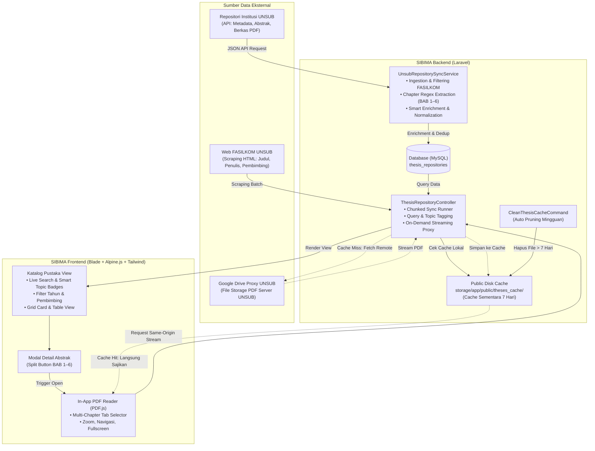
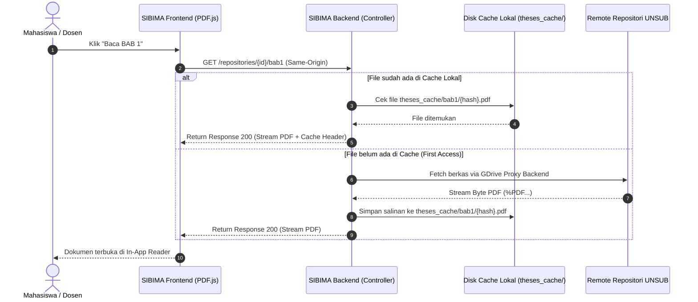

# Arsitektur Katalog Pustaka Skripsi SIBIMA

Dokumen ini menjelaskan arsitektur teknis, alur data, integrasi sumber eksternal, dan mekanisme pengiriman naskah digital pada menu **Katalog Pustaka Skripsi** di Sistem Informasi Bimbingan Mahasiswa (**SIBIMA**) Fakultas Ilmu Komputer Universitas Subang.

---

## 1. Ikhtisar & Tujuan Sistem

Menu Katalog Pustaka di SIBIMA dirancang untuk:
1. **Sentralisasi Arsip Ilmiah**: Mengumpulkan karya skripsi mahasiswa FASILKOM ke dalam satu katalog interaktif yang mudah dicari oleh mahasiswa dan dosen pembimbing.
2. **Sinkronisasi Multi-Sumber**: Menggabungkan data dari **Website FASILKOM UNSUB** (data dasar skripsi & pembimbing) dan **Repositori Institusi UNSUB** (data abstrak lengkap & berkas naskah PDF BAB 1–6).
3. **Penyajian Cepat & Efisien (*On-Demand Streaming*)**: Menyajikan naskah PDF langsung di browser (*In-App Reader*) tanpa membebani kapasitas penyimpanan (*storage disk*) server VPS.

---

## 2. Diagram Arsitektur Tingkat Tinggi



---

## 3. Komponen Sumber Data Eksternal

Katalog SIBIMA mengintegrasikan dua sumber data eksternal dengan karakteristik masing-masing:

| Komponen | Sumber 1: Web FASILKOM UNSUB | Sumber 2: Repositori Institusi UNSUB |
| :--- | :--- | :--- |
| **URL Dasar** | `https://fasilkom.unsub.ac.id/repositori-skripsi` | `https://repo.unsub.ac.id/api/documents` |
| **Metode Akses** | Web Scraping (HTML XPath DOM Parsing) | RESTful JSON API + GDrive File Proxy |
| **Atribut yang Diambil** | Judul, Nama Mahasiswa, NPM, Tahun Angkatan, Dosen Pembimbing 1 & 2 | Abstrak Lengkap, ID File Google Drive (BAB I s/d VI), Program Studi, Tanggal Unggah |
| **Peran Utama** | Sumber data historis awal & data pembimbing skripsi | Pengaya teks abstrak dan sumber berkas naskah PDF asli |

---

## 4. Pipeline ETL & Sinkronisasi Data

Pipeline sinkronisasi diimplementasikan dalam [`UnsubRepositorySyncService.php`](file:///c:/Users/Bagus%20Ali%20Akbar/Herd/sibima/app/Services/UnsubRepositorySyncService.php).

### Tahap 1: Ingestion & Filter Ketat FASILKOM
Repositori UNSUB menampung seluruh skripsi dari berbagai fakultas. SIBIMA menerapkan whitelist regex ketat untuk memastikan **hanya karya FASILKOM** yang masuk ke sistem:
```php
public function isFasilkomDocument(array $doc): bool
{
    $prodi = $doc['program_studi'] ?? '';
    $fakultas = $doc['fakultas'] ?? '';
    $pattern = '/\b(ilmu komputer|fasilkom|sistem informasi|teknik informatika|ti|si)\b/i';

    return preg_match($pattern, $prodi) === 1 || preg_match($pattern, $fakultas) === 1;
}
```

### Tahap 2: Ekstraksi Naskah Bab Cerdas (Regex Parsing)
Berkas di repositori penamaannya bervariasi (`BAB 1.pdf`, `bab_i.pdf`, `bab-01-revisi.pdf`, `BAB VI.pdf`). Service mengekstrak ID berkas Google Drive untuk masing-masing bab (BAB 1–6) secara otomatis:
```php
// Ekstraksi BAB 1 s/d BAB 6 dengan regex case-insensitive
preg_match('/bab\s*[\-_]?(?:i\b|1\b)/i', $filename);  // BAB 1
preg_match('/bab\s*[\-_]?(?:ii\b|2\b)/i', $filename); // BAB 2
preg_match('/bab\s*[\-_]?(?:iii\b|3\b)/i', $filename);// BAB 3
preg_match('/bab\s*[\-_]?(?:iv\b|4\b)/i', $filename); // BAB 4
preg_match('/bab\s*[\-_]?(?:v\b|5\b)/i', $filename);  // BAB 5
preg_match('/bab\s*[\-_]?(?:vi\b|6\b)/i', $filename); // BAB 6
```

### Tahap 3: Deduplikasi & Smart Enrichment
Sebelum membuat record baru, sistem mencari apakah data mahasiswa sudah ada berdasarkan **NPM** atau kemiripan **Judul Skripsi**:
* **Jika Belum Ada**: Buat record baru di tabel `thesis_repositories`.
* **Jika Sudah Ada**: Lakukan *enrichment* (memperbarui abstrak yang sebelumnya kosong, menambahkan tautan bab yang baru ditemukan, dan melengkapi data pembimbing).

### Tahap 4: Eksekusi Chunked Real-Time
Untuk mencegah kegagalan *PHP Maximum Execution Timeout (30s)* pada web server, proses sinkronisasi dijalankan secara bertahap via AJAX per *chunk* (misal: 4 dokumen per request) dengan *progress bar* interaktif di frontend.

---

## 5. Arsitektur Penyimpanan: On-Demand Streaming

Untuk menghemat disk VPS dan mempercepat akses, SIBIMA menerapkan strategi **On-Demand Streaming**:



### Keunggulan Arsitektur On-Demand Streaming:
1. **Zero Storage saat Sinkronisasi**: Database hanya mencatat tautan URL/GDrive ID. Sinkronisasi 144+ dokumen selesai dalam hitungan detik dengan konsumsi penyimpanan lokal **0 MB**.
2. **Bypass CORS & Keamanan Same-Origin**: Mengakses file langsung dari domain Google Drive/UNSUB di browser akan diblokir oleh kebijakan *Cross-Origin Resource Sharing (CORS)*. Dengan melewatkannya melalui backend SIBIMA, browser membaca PDF dari domain yang sama (*same-origin*).
3. **Resiliensi Tinggi**: Jika koneksi backend ke server UNSUB mengalami kendala, endpoint otomatis melakukan *fallback* redirect langsung ke tautan remote asli.

---

## 6. Pemeliharaan Otomatis (*Auto-Cache Cleanup*)

Untuk menjamin kapasitas disk server VPS tidak pernah penuh akibat penumpukan file cache:

1. **Perintah Artisan Pembersih**:
   ```bash
   php artisan repositories:clean-cache --days=7
   ```
   * Memindai direktori `storage/app/public/theses_cache/`.
   * Menghapus file PDF yang usia modifikasinya telah melampaui batas ambang (default: 7 hari).
   * Opsi `--all`: Mengosongkan seluruh file cache secara instan.
2. **Jadwal Eksekusi Rutin**:
   Telah didaftarkan pada [`routes/console.php`](file:///c:/Users/Bagus%20Ali%20Akbar/Herd/sibima/routes/console.php) untuk dieksekusi setiap **Minggu pukul 02:00 WIB**:
   ```php
   Schedule::command('repositories:clean-cache --days=7')->weeklyOn(0, '02:00');
   ```

---

## 7. Skema Basis Data

Data repositori disimpan pada tabel `thesis_repositories`:

| Nama Kolom | Tipe Data | Deskripsi |
| :--- | :--- | :--- |
| `id` | `BIGINT UNSIGNED` (PK) | Auto-increment primary key |
| `identifier` | `VARCHAR(50)` | Nomor Pokok Mahasiswa (NPM) |
| `name` | `VARCHAR(255)` | Nama lengkap penulis skripsi |
| `title` | `VARCHAR(500)` | Judul lengkap tugas akhir / skripsi |
| `year` | `YEAR` / `INT` | Tahun angkatan / kelulusan skripsi |
| `pembimbing1` | `VARCHAR(255)` | Nama pembimbing utama (ternormalisasi) |
| `pembimbing2` | `VARCHAR(255)` | Nama pembimbing pendamping |
| `abstract` | `TEXT` | Teks abstrak lengkap Bahasa Indonesia / Inggris |
| `file_path` | `VARCHAR(255)` | Path / URL berkas BAB 1 |
| `file_path_bab2` | `VARCHAR(255)` | Path / URL berkas BAB 2 |
| `file_path_bab3` | `VARCHAR(255)` | Path / URL berkas BAB 3 |
| `file_path_bab4` | `VARCHAR(255)` | Path / URL berkas BAB 4 |
| `file_path_bab5` | `VARCHAR(255)` | Path / URL berkas BAB 5 |
| `file_path_bab6` | `VARCHAR(255)` | Path / URL berkas BAB 6 |
| `created_at` / `updated_at` | `TIMESTAMP` | Waktu pembuatan dan pembaruan data |

---

## 8. Fitur Antarmuka Pengguna (*UI/UX*)

1. **Smart Topic Categorization**:
   Menggunakan analisis kata kunci judul untuk mengelompokkan skripsi ke dalam 8 kategori otomatis (*Web App, Mobile, AI & Data Science, SPK, UI/UX, IoT, E-Commerce*).
2. **Multi-Chapter In-App PDF Reader**:
   * Menampilkan tab navigasi berkas BAB 1 s/d BAB 6.
   * Dilengkapi fitur zoom, navigasi halaman cepat, layar penuh (*fullscreen*), dan opsi unduh file.
3. **Adaptive Dark Mode & Light Mode**:
   * Skema tombol pil menggunakan palet terstandar (`rose`, `amber`, `indigo`, `emerald`, `purple`, `cyan`).
   * Menggunakan *floating inset divider* (`h-4 w-px bg-white/30`) dengan margin yang seimbang dan ramah mata di mode terang maupun gelap.

---

## 9. Ringkasan File & Peran Teknis

| Lokasi Berkas | Peran dalam Arsitektur |
| :--- | :--- |
| [`app/Services/UnsubRepositorySyncService.php`](file:///c:/Users/Bagus%20Ali%20Akbar/Herd/sibima/app/Services/UnsubRepositorySyncService.php) | Ingestion API UNSUB, regex filter Fasilkom, ekstraksi bab, & deduplikasi. |
| [`app/Http/Controllers/ThesisRepositoryController.php`](file:///c:/Users/Bagus%20Ali%20Akbar/Herd/sibima/app/Http/Controllers/ThesisRepositoryController.php) | Controller katalog, streaming proxy naskah bab, & runner chunk sync. |
| [`app/Console/Commands/CleanThesisCacheCommand.php`](file:///c:/Users/Bagus%20Ali%20Akbar/Herd/sibima/app/Console/Commands/CleanThesisCacheCommand.php) | Perintah artisan pembersih file cache PDF (>7 hari). |
| [`routes/console.php`](file:///c:/Users/Bagus%20Ali%20Akbar/Herd/sibima/routes/console.php) | Penjadwalan mingguan `repositories:clean-cache`. |
| [`routes/web.php`](file:///c:/Users/Bagus%20Ali%20Akbar/Herd/sibima/routes/web.php) | Routing streaming BAB 1–6 & AJAX endpoint sinkronisasi. |
| [`resources/views/repositories/index.blade.php`](file:///c:/Users/Bagus%20Ali%20Akbar/Herd/sibima/resources/views/repositories/index.blade.php) | Antarmuka katalog, modal abstrak, In-App PDF reader, & modal sinkronisasi. |
| [`tests/Feature/UnsubRepositorySyncTest.php`](file:///c:/Users/Bagus%20Ali%20Akbar/Herd/sibima/tests/Feature/UnsubRepositorySyncTest.php) | Unit & feature test sinkronisasi dan streaming BAB 1–6. |
| [`tests/Feature/CleanThesisCacheTest.php`](file:///c:/Users/Bagus%20Ali%20Akbar/Herd/sibima/tests/Feature/CleanThesisCacheTest.php) | Unit test pembersihan cache file PDF. |
